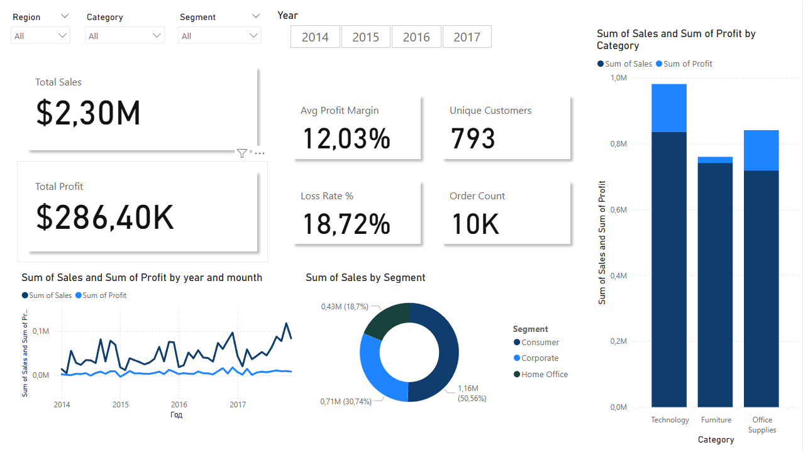
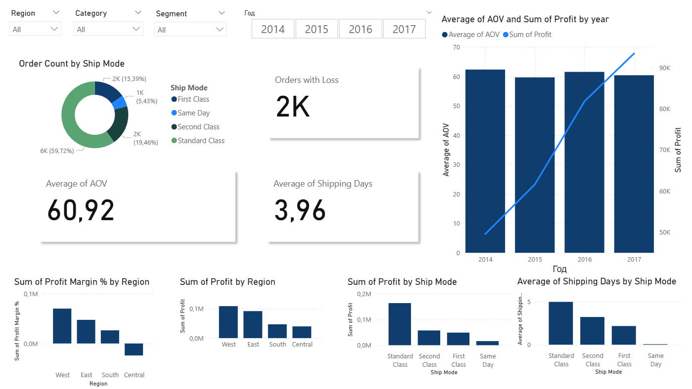
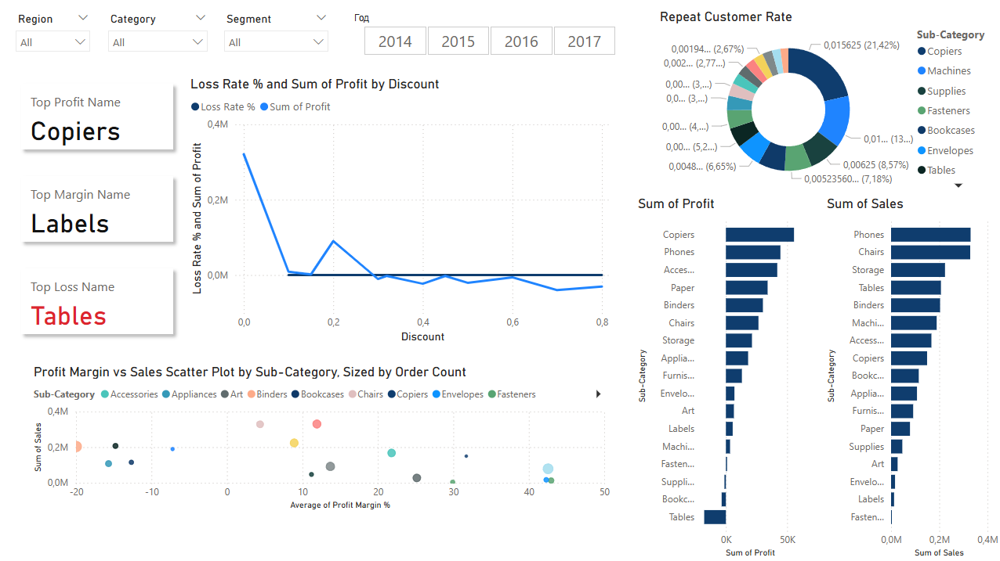

# Superstore Sales Dashboard

Полный цикл BI-проекта: от подготовки данных до интерактивных дашбордов. Проект демонстрирует весь путь аналитика через Python, SQL и Power BI.

---

## Содержание

- [Быстрый старт](#быстрый-старт)
- [Структура проекта](#структура-проекта)
- [Что внутри](#что-внутри)
- [Технологический стек](#технологический-стек)
- [Ключевые инсайты](#ключевые-инсайты)
- [Дашборды](#дашборды)
- [Автор](#автор)

---

## Быстрый старт

### Вариант 1: Просмотр анализа онлайн

Весь процесс EDA и трансформации данных доступен прямо в GitHub:

[**Открыть анализ в браузере →**](notebooks/01_EDA_Analysis.ipynb)

Можно просмотреть графики, статистику и выводы без скачивания. GitHub отрендерит ноутбук с полной интерактивностью.

---

### Вариант 2: Локальный запуск

**Шаг 1: Клонируйте репозиторий**

```bash
git clone https://github.com/phineaeas/Superstore-Sales-Dashboard.git
cd Superstore-Sales-Dashboard
```

**Шаг 2: Установите зависимости**

```bash
pip install pandas numpy matplotlib jupyter
```

**Шаг 3: Откройте Jupyter Notebook**

```bash
jupyter notebook notebooks/01_EDA_Analysis.ipynb
```

**Шаг 4: Используйте SQL-скрипты**

Все SQL-скрипты находятся в папке [`sql/`](sql/). Выполните их в вашей СУБД в порядке:

1. [`01_create_tables.sql`](sql/01_create_tables.sql) — создание таблиц
2. [`02_data_loading.sql`](sql/02_data_loading.sql) — загрузка данных
3. [`03_metrics_calculation.sql`](sql/03_metrics_calculation.sql) — расчет метрик

**Шаг 5: Откройте Power BI отчет**

Файл: [`powerbi/Superstore_Sales_Dashboard.pbix`](powerbi/Superstore_Sales_Dashboard.pbix)


---

## Структура проекта

```
Superstore-Sales-Dashboard/
├── assets/                          # Скриншоты дашбордов
│   ├── 01_executive_overview.png    # Общий обзор продаж
│   ├── 02_operational_metrics.png   # Операционные показатели
│   └── 03_product_deep_dive.png     # Анализ продуктов
│
├── data/
│   ├── raw/                         # Исходные данные
│   └── processed/                   # Очищенные данные
│
├── notebooks/
│   └── 01_EDA_Analysis.ipynb        # Полный анализ и визуализация
│
├── sql/
│   ├── 01_create_tables.sql         # Структура таблиц
│   ├── 02_data_loading.sql          # Загрузка данных
│   └── 03_metrics_calculation.sql   # Расчет KPI
│
├── powerbi/
│   └── Superstore_Sales_Dashboard.pbix  # Итоговый отчет
│
├── README.md
├── LICENSE
└── .gitignore
```

---

## Что внутри

### Анализ данных (Python)

**Файл:** [`notebooks/01_EDA_Analysis.ipynb`](notebooks/01_EDA_Analysis.ipynb)

Ноутбук содержит:

- Загрузка и очистка данных (pandas, numpy)
- Проверка пропусков, выбросов, аномалий
- Описательная статистика по регионам, категориям, сегментам
- Анализ временных рядов и трендов продаж
- Визуализация зависимостей (matplotlib)
- Выводы и рекомендации

**Открыть:** [notebooks/01_EDA_Analysis.ipynb](notebooks/01_EDA_Analysis.ipynb)

---

### Витрины данных (SQL)

Три SQL-скрипта готовят данные для Power BI:

| Файл | Назначение |
|------|-----------|
| [`01_create_tables.sql`](sql/01_create_tables.sql) | Создание таблиц фактов и измерений |
| [`02_data_loading.sql`](sql/02_data_loading.sql) | ETL процесс загрузки и трансформации |
| [`03_metrics_calculation.sql`](sql/03_metrics_calculation.sql) | Расчет KPI (доход, прибыль, ROI) |

---

### Дашборды (Power BI)

**Инструменты:**

- **Power Query**: парсинг данных, нормализация, удаление дубликатов, вычисляемые столбцы
- **DAX**: бизнес-логика и меры


---

## Технологический стек

| Компонент | Инструмент |
|-----------|-----------|
| Подготовка данных | Python (pandas, numpy) |
| Визуализация / EDA | Jupyter Notebook, matplotlib |
| Трансформация данных | SQL (ETL) |
| Бизнес-логика | Power Query, DAX |
| Отчетность | Power BI Desktop |
| Версионирование | Git, GitHub |

---

## Ключевые инсайты

Основные выводы из анализа:

- **Сезонность**: пики продаж в ноябре-декабре (+40% vs среднее)
- **Лучшие категории**: технология (39% доход), мебель (32% объема)
- **Региональное распределение**: East и West дают 60% прибыли; South требует оптимизации
- **VIP клиенты**: 20% клиентской базы генерируют 70% доходов
- **Риск**: 15% заказов с отрицательной маржой (требует переговора цен)

---

## Дашборды

### Executive Overview



Общая картина: выручка, прибыль, количество заказов, динамика по месяцам.

---

### Операционные метрики



Детализация по регионам, категориям товаров, средний чек, оборачиваемость.

---

### Анализ продуктов



Рейтинг товаров по прибыльности, объему продаж, маржинальности.

---

## Как это работает

1. **Сырые данные** → `data/raw/` (CSV, Excel, DB)
2. **Очистка** → Python ноутбук (пропуски, дубликаты, типы)
3. **SQL витрины** → готовые таблицы для отчетности
4. **Power BI** → интерактивные графики и фильтры через DAX
5. **Результат** → дашборды для бизнеса

Каждый этап документирован и легко адаптируется под новые данные или требования.

---

## Автор

**Виктория Копылова**
BI/Data Analyst
kopylovavika1@gmail.com
[github.com/phineaeas](https://github.com/phineaeas)

---

## Лицензия

MIT License — см. файл [LICENSE](LICENSE)
